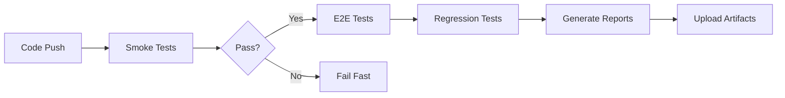

# Next.js Commerce - Automated Testing Suite


A comprehensive automated testing suite for the Next.js Commerce demo application, featuring E2E, regression, and smoke tests with CI/CD integration.

---

## 🎯 Project Overview

This project provides automated testing coverage for the [Next.js Commerce](https://demo.vercel.store) application using Playwright and GitHub Actions. It demonstrates professional QA practices including test organization, CI/CD integration, and comprehensive documentation.

**Target Application:** https://demo.vercel.store

---

## ✨ Features

- ✅ **E2E Testing** - Complete user journey validation
- ✅ **Regression Testing** - Ensure features don't break
- ✅ **Smoke Testing** - Quick critical path validation
- ✅ **Cross-Browser Testing** - Chrome, Firefox, Safari
- ✅ **Mobile Testing** - iOS and Android emulation
- ✅ **CI/CD Integration** - Automated execution on GitHub Actions
- ✅ **Rich Reporting** - HTML, JSON, and JUnit reports
- ✅ **Video Recording** - Capture failed test scenarios
- ✅ **Screenshots** - Visual evidence of failures

---

## 🚀 Quick Start

### Prerequisites

- **Node.js** 18 or higher
- **npm** 9 or higher
- **Git**

### Installation

```bash
# 1. Clone the repository
git clone https://github.com/YOUR-USERNAME/nextjs-commerce-automation.git
cd nextjs-commerce-automation

# 2. Install dependencies
npm install

# 3. Install Playwright browsers
npx playwright install --with-deps

# 4. Run tests
npm test
```

That's it! Tests will run against the live demo at https://demo.vercel.store

---

## 📋 Available Commands

### Running Tests

```bash
# Run all tests
npm test

# Run specific test suites
npm run test:e2e           # End-to-end tests
npm run test:regression    # Regression tests
npm run test:smoke         # Smoke tests

# Run tests on specific browsers
npm run test:chrome        # Chromium only
npm run test:firefox       # Firefox only
npm run test:safari        # WebKit/Safari only

# Interactive & Debug modes
npm run test:ui            # Open Playwright UI
npm run test:headed        # Run with visible browser
npm run test:debug         # Debug mode with inspector

# Generate and view reports
npm run test:report        # Open HTML report
```

### Example Output

```bash
$ npm test

Running 15 tests using 3 workers

  ✓ homepage.spec.js:5:3 › should load homepage successfully (2.1s)
  ✓ homepage.spec.js:12:3 › should display navigation menu (1.8s)
  ✓ product-flow.spec.js:7:3 › should complete full product browsing journey (4.2s)
  
  15 passed (23.5s)

To view HTML report, run: npx playwright show-report
```

---

## 🗂️ Project Structure

```
nextjs-commerce-automation/
│
├── tests/
│   ├── e2e/                      # End-to-end tests
│   │   ├── homepage.spec.js      # Homepage functionality
│   │   └── product-flow.spec.js  # Product browsing flows
│   │
│   ├── regression/               # Regression tests
│   │   └── cart.spec.js          # Cart functionality
│   │
│   └── smoke/                    # Smoke tests
│       └── basic.spec.js         # Critical path validation
│
├── .github/
│   └── workflows/
│       └── test.yml              # CI/CD pipeline configuration
│
├── playwright-report/            # Generated HTML reports
├── test-results/                 # Test artifacts (screenshots, videos)
│
├── playwright.config.js          # Playwright configuration
├── package.json                  # Dependencies and scripts
├── README.md                     # This file
└── TESTING_STRATEGY.md          # Detailed testing strategy
```

---

## 🧪 Test Coverage

### E2E Tests (End-to-End)
- ✅ Homepage loading and rendering
- ✅ Navigation menu functionality
- ✅ Product search and filtering
- ✅ Product detail page viewing
- ✅ Category navigation
- ✅ Responsive design validation
- ✅ Complete user journeys

### Regression Tests
- ✅ Cart icon visibility
- ✅ Cart state management
- ✅ Add to cart functionality
- ✅ Cart persistence across navigation
- ✅ Error handling

### Smoke Tests
- ✅ Application accessibility
- ✅ Critical page loads
- ✅ Navigation functionality
- ✅ Product listings display
- ✅ Search availability
- ✅ Performance baseline

**Total Test Cases:** 25+  
**Browsers Covered:** 3 (Chrome, Firefox, Safari)  
**Mobile Devices:** 2 (iPhone, Pixel)

---

## 🔄 CI/CD Pipeline

### Automated Execution

Tests run automatically on:
- ✅ Push to `main` or `develop` branches
- ✅ Pull request creation/updates
- ✅ Manual workflow dispatch

### Pipeline Stages



### Viewing Results

1. Go to **Actions** tab in GitHub
2. Select the workflow run
3. View test results and download artifacts
4. Check test summary in PR comments

---

## 📊 Test Reports

### HTML Report
Interactive report with:
- Test execution timeline
- Pass/fail status
- Screenshots of failures
- Video recordings
- Execution traces

```bash
# View report after test run
npm run test:report
```

### CI Artifacts
After each CI run, download:
- HTML reports
- Screenshots (failures only)
- Videos (failures only)
- JUnit XML (for integration)

---

## 🛠️ Configuration

### Playwright Configuration

Key settings in `playwright.config.js`:

```javascript
{
  testDir: './tests',
  timeout: 30000,
  retries: 2,  // In CI only
  workers: 3,  // Parallel execution
  
  use: {
    baseURL: 'https://demo.vercel.store',
    screenshot: 'only-on-failure',
    video: 'retain-on-failure',
  }
}
```

### Environment Variables

```bash
# Optional: Override base URL
export BASE_URL=https://your-custom-url.com
npm test
```

---

## 🐛 Troubleshooting

### Common Issues

**Issue: Playwright browsers not installed**
```bash
npx playwright install --with-deps
```

**Issue: Tests fail with timeout**
```bash
# Increase timeout in playwright.config.js
timeout: 60000  // 60 seconds
```

**Issue: Tests fail in CI but pass locally**
- Check Node.js version matches (18+)
- Verify network connectivity
- Review CI logs for errors

**Issue: Flaky tests**
```javascript
// Add better waits
await page.waitForLoadState('networkidle');
await expect(element).toBeVisible();
```

---

## 📈 Scaling & Maintenance

### Adding New Tests

1. Create test file in appropriate directory
2. Follow naming convention: `feature.spec.js`
3. Use descriptive test names
4. Add proper assertions
5. Run locally before committing

**Example:**
```javascript
// tests/e2e/checkout.spec.js
import { test, expect } from '@playwright/test';

test('should complete checkout process', async ({ page }) => {
  await page.goto('/');
  // Test implementation
});
```

### Best Practices

- ✅ Use `data-testid` attributes when possible
- ✅ Avoid hard-coded waits (`page.waitForTimeout`)
- ✅ Use auto-waiting features (`expect`, `click`, etc.)
- ✅ Keep tests independent (no shared state)
- ✅ Clean, descriptive test names
- ✅ One assertion per test when possible

---

## 📚 Documentation

- **[Testing Strategy](TESTING_STRATEGY.md)** - Comprehensive testing approach
- **[Playwright Docs](https://playwright.dev)** - Official Playwright documentation
- **[GitHub Actions](https://docs.github.com/actions)** - CI/CD documentation

---

## 🤝 Contributing

### Setup for Development

```bash
# Fork and clone
git clone https://github.com/YOUR-USERNAME/nextjs-commerce-automation.git
cd nextjs-commerce-automation

# Create feature branch
git checkout -b feature/new-tests

# Make changes and test
npm test

# Commit and push
git add .
git commit -m "Add: new test for feature X"
git push origin feature/new-tests

# Create pull request
```

### Contribution Guidelines

1. Follow existing code style
2. Write clear test descriptions
3. Ensure all tests pass locally
4. Update documentation if needed
5. Add comments for complex logic

---

## 📝 Test Execution Metrics

### Performance Benchmarks

- **Smoke Tests:** ~2-3 minutes
- **E2E Tests:** ~8-10 minutes
- **Regression Tests:** ~3-5 minutes
- **Full Suite:** ~15 minutes

### Success Criteria

- ✅ Pass Rate: > 95%
- ✅ Flakiness Rate: < 5%
- ✅ Coverage: 80%+ critical paths
- ✅ Execution Time: < 15 minutes

---

## 🔐 Security

- No sensitive data in tests
- No authentication credentials stored
- Environment variables for secrets
- Read-only operations only
- Public demo data usage

---

## 📞 Support & Contact

For issues or questions:
1. Check [Troubleshooting](#-troubleshooting) section
2. Review [Testing Strategy](TESTING_STRATEGY.md)
3. Open an issue on GitHub
4. Contact the QA team

---

## 📄 License

This project is licensed under the MIT License.

---

## 🙏 Acknowledgments

- [Next.js Commerce](https://github.com/vercel/commerce) - Demo application
- [Playwright](https://playwright.dev) - Testing framework
- [Vercel](https://vercel.com) - Hosting platform

---

## 📅 Changelog

### Version 1.0.0 (October 2025)
- Initial release
- E2E test suite
- Regression tests
- Smoke tests
- CI/CD integration
- Cross-browser support
- Mobile testing
- Comprehensive documentation

---

**Built with ❤️ for quality assurance**