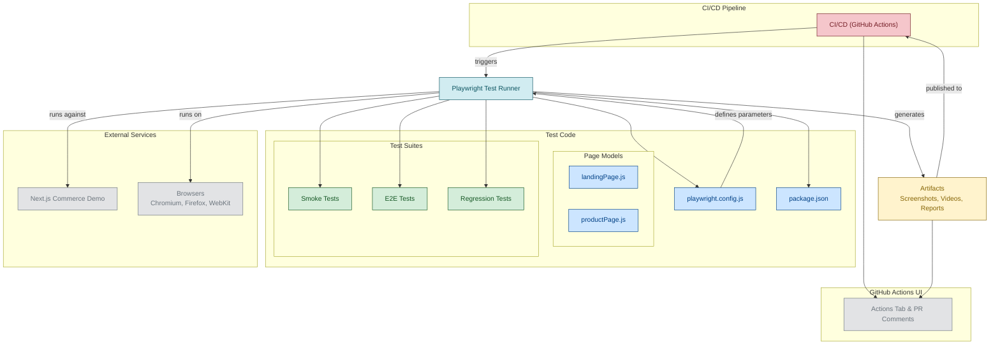

# Next.js Commerce - Automated Testing Suite


A comprehensive automated testing suite for the Next.js Commerce demo application, featuring E2E, regression, and smoke tests with CI/CD integration.

---

## 🎯 Project Overview

This project provides automated testing coverage for the [Next.js Commerce](https://demo.vercel.store) application using Playwright and GitHub Actions. It demonstrates professional QA practices including test organization, CI/CD integration, and comprehensive documentation.

**Target Application:** https://demo.vercel.store

---

## ✨ Features

- ✅ **E2E Testing** - Complete user journey validation
- ✅ **Regression Testing** - Ensure features don't break
- ✅ **Smoke Testing** - Quick critical path validation
- ✅ **Cross-Browser Testing** - Chrome, Firefox
- ✅ **parallel testing ** - Chrome, Firefox with multiple workers
- ✅ **CI/CD Integration** - Automated execution on GitHub Actions
- ✅ **Rich Reporting** - Allure, HTML, JSON reports
- ✅ **Screenshots** - Visual evidence of failures

---

## 🚀 Quick Start

### Prerequisites

- **Node.js** 18 or higher
- **npm** 9 or higher
- **Git**

### Installation

```bash
# 1. Clone the repository
git clone https://github.com/Ekanto/ecommerce-test
cd ecommerce-test

# 2. Install dependencies
npm install

# 3. Install Playwright browsers
npx playwright install

# 4. Run tests
npm test
```

That's it! Tests will run against the live demo at https://demo.vercel.store

---

## 📋 Available Commands

### Running Tests

```bash
# Run all tests
npm test

# Run specific test suites
npm run test:e2e           # End-to-end tests
npm run test:regression    # Regression tests
npm run test:smoke         # Smoke tests

# Run tests on specific browsers
npm run test:chrome        # Chromium only
npm run test:firefox       # Firefox only

# Interactive & Debug modes
npm run test:headed        # Run with visible browser
npm run test:debug         # Debug mode with inspector

# Generate and view reports
npm run test:report        # Open HTML report
```
---

## 🗂️ Project Structure

```
.github/
    └── workflows/
        └── test.yml
pages/
    ├── landingPage.js
    ├── productPage.js
    ├── regression.js
    └── smoke.js
screenshots/
    └── checkout.png
tests/
    ├── e2e/
        ├── landing.spec.js
        └── product.spec.js
    ├── regression/
        └── regression.spec.js
    └── smoke/
        └── smoke.spec.js
.gitignore
BUG_REPORT.md
package-lock.json
package.json
playwright.config.js
README.md
TESTING_STRATEGY.md
```

---

## 🧪 Test Coverage

### E2E Tests (End-to-End)
- ✅ Homepage loading and rendering
- ✅ Product search
- ✅ Product detail page viewing
- ✅ Cart button functionality
- ✅ Footer links redirection and functionality
- ✅ Add to cart
- ✅ Selecting variant and color. 
- ✅ Product photo validation
### Regression Tests
- ✅ Switching between categories
- ✅ Product sorting Price:High to low
- ✅ Product sorting Price:Low to High

### Smoke Tests
- ✅ Application accessibility
- ✅ No critical page load error
- ✅ Navigation functionality
- ✅ Product listings display
- ✅ Product redirections 


**Total Test Cases:** 14, 
**Browsers Covered:** 2 (Chrome, Firefox)  

---

## 🔄 CI/CD Pipeline

### Automated Execution

Tests run automatically on:
- ✅ Push to `main` branches

### Pipeline Stages



### Viewing Results

1. Go to **Actions** tab in GitHub
2. Select the workflow run
3. View test results and download artifacts


---

## 📊 Test Reports

### HTML Report
Interactive report with:
- Test execution timeline
- Pass/fail status
- Screenshots of failures
- Video recordings
- Execution traces

```bash
# View report after test run
npm run test:report
```

### CI Artifacts
After each CI run, download:
- Allure 
- HTML reports

---

## 🐛 Troubleshooting

### Common Issues

**Issue: Playwright browsers not installed**
```bash
npx playwright install
```

**Issue: Tests fail with timeout**
```bash
# Increase timeout in playwright.config.js
timeout: 60000  // 60 seconds
```

**Issue: Tests fail in CI but pass locally**
- Check Node.js version matches (18+)
- Verify network connectivity
- Review CI logs for errors

**Issue: Flaky tests**
```javascript
// Add better waits
await page.waitForLoadState('networkidle');
await expect(element).toBeVisible();
```

---

## 📈 Scaling & Maintenance

### Adding New Tests

1. Create test file in appropriate directory
2. Follow naming convention: `feature.spec.js`
3. Use descriptive test names
4. Add proper assertions
5. Run locally before committing

**Example:**
```javascript
// tests/e2e/checkout.spec.js
import { test, expect } from '@playwright/test';

test('should complete checkout process', async ({ page }) => {
  await page.goto('/');
  // Test implementation
});
```

### Best Practices

- ✅ Use `data-testid` attributes when possible
- ✅ Avoid hard-coded waits (`page.waitForTimeout`)
- ✅ Use auto-waiting features (`expect`, `click`, etc.)
- ✅ Keep tests independent (no shared state)
- ✅ Clean, descriptive test names
- ✅ One assertion per test when possible

---

## 📚 Documentation

- **[Testing Strategy](TESTING_STRATEGY.md)** - Comprehensive testing approach
- **[Playwright Docs](https://playwright.dev)** - Official Playwright documentation
- **[GitHub Actions](https://docs.github.com/actions)** - CI/CD documentation

---


### Contribution Guidelines

1. Follow existing code style
2. Write clear test descriptions
3. Ensure all tests pass locally
4. Update documentation if needed
5. Add comments for complex logic

---

## 📝 Test Execution Metrics

### Performance Benchmarks

- **Smoke Tests:** ~1 minute
- **E2E Tests:** ~2 minutes
- **Regression Tests:** ~2 minutes
- **Report Generation:** ~1 minute
- **Full Suite:** ~3 minutes

### Success Criteria

- ✅ Pass Rate: > 95%
- ✅ Flakiness Rate: < 5%
- ✅ Coverage: 80%+ critical paths
- ✅ Execution Time: < 15 minutes

---

## 🔐 Security

- No sensitive data in tests
- No authentication credentials stored
- Environment variables for secrets
- Read-only operations only
- Public demo data usage

---

## 📞 Support & Contact

For issues or questions:
1. Check [Troubleshooting](#-troubleshooting) section
2. Review [Testing Strategy](TESTING_STRATEGY.md)
3. Open an issue on GitHub
4. Contact me at **umarekanto@gmail.com**


